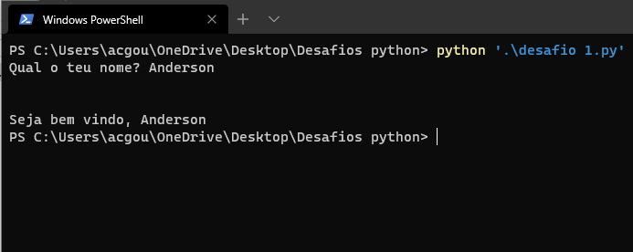
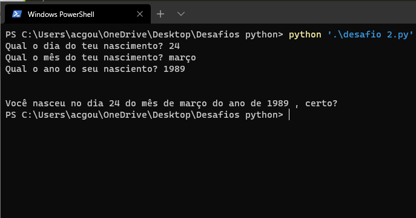
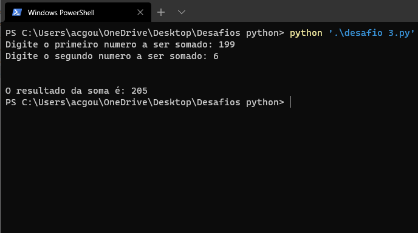
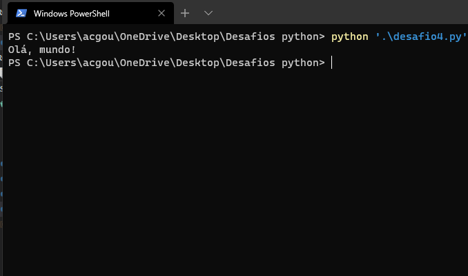
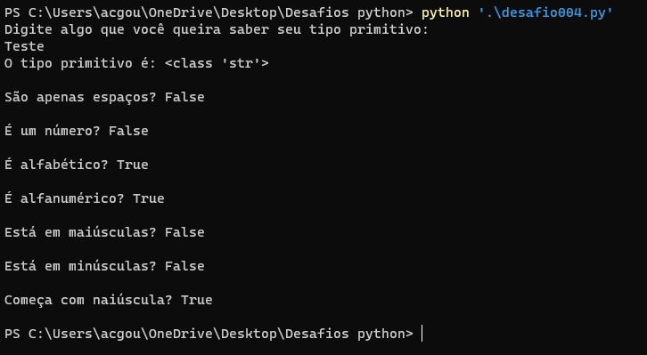

# Lista de "desafios" do curso de programação em python3 do [Curso em Vídeo](https://www.cursoemvideo.com/course/python-3-mundo-1/)

## Mundo 1

### Desafio 0.1 (Nível: Café com Leite)

Crie um script Python que leia o nome de uma pessoa e mostre uma mensagem de boas-vindas de acordo com o valor digitado.

### Desafio 0.2 (Nível: Café com Leite)

Criar um script python que leia o dia, mês e o ano de nascimento de uma pessoa e mostre uma mensagem com a data formatada.

### Desafio 0.3 (Nível: Café com Leite)

Criar um script python que receba dois valores numéricos e some os dois, retornando o resultado.

### Desafio 001 (Nível: Café com leite)

Crie um programa que escreva "Olá, mundo!" na tela.

### Desafio 002 (Nível: Café com leite)

Exercício Python 2: Faça um programa que leia o nome de uma pessoa e mostre uma mensagem de boas-vindas.
 
**Mesma coisa do desafio 0.1.**

### Desafio 003 (Nível: Café com leite)

O mesmo que no desafio 0.3

### Desafio 004 (Nível: Café com leite)

Faça um programa que leia algo digitado e mostra na tela o seu tipo primitivo e todas as informações possíveis.

