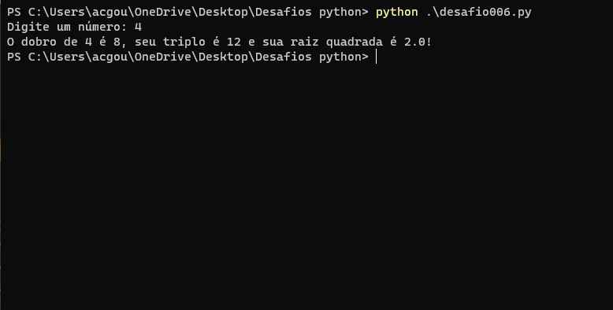

# Lista de "desafios" do curso de programação em python3 do [Curso em Vídeo](https://www.cursoemvideo.com/course/python-3-mundo-1/)

## Mundo 1

### Desafio 0.1 (Nível: Café com Leite)

Crie um script Python que leia o nome de uma pessoa e mostre uma mensagem de boas-vindas de acordo com o valor digitado.

### Desafio 0.2 (Nível: Café com Leite)

Criar um script python que leia o dia, mês e o ano de nascimento de uma pessoa e mostre uma mensagem com a data formatada.

### Desafio 0.3 (Nível: Café com Leite)

Criar um script python que receba dois valores numéricos e some os dois, retornando o resultado.

### Desafio 001 (Nível: Café com leite)

Crie um programa que escreva "Olá, mundo!" na tela.

### Desafio 002 (Nível: Café com leite)

Exercício Python 2: Faça um programa que leia o nome de uma pessoa e mostre uma mensagem de boas-vindas.
 
**Mesma coisa do desafio 0.1.**

### Desafio 003 (Nível: Café com leite)

O mesmo que no desafio 0.3

### Desafio 004 (Nível: Café com leite)

Faça um programa que leia algo digitado e mostra na tela o seu tipo primitivo e todas as informações possíveis.

### Desafio 005 (Níve: Fácil)

Faça um programa que leia um inteiro e mostre na tela o seu sucessor e seu antecessor.

### Desafio 006 (Nível: Fácil)

Crie um algoritmo leia um numero e mostre o seu dobro, triplo e raiz quadrada.

### Desafio 007 (Nível: Fácil)

Crie um programa que leia as duas notas de um aluno, calcule e mostre sua média.

### Desafio 008 (Nível: Fácil)

Escreva um programa que leia um valor em metros e o exiba convertido em centímetros e milímetros.

### Desafio 009 (Nível: Fácil)

Faça um programa que leia um numero inteiro e mostre na tela a sua tabuada.

### Desafio 010 (Nível: Fácil)

Crie um programa que leia a quantidade de dinheiro que o usuário tem e mostre quantos dólares ele pode comprar. Considere o dola a R$5,98.

### Desafio 011 (Nível: Fácil)

Faça um programa que leia a altura e a largura de uma parede em metros, calcule a sua área e a quantidade de tinta necessária para pintá-la, sabendo que cada litro de tinta pinta uma área de 2m².

### Desafio 012 (Nível: Fácil)

Faça um algoritmo que leia o preço de um produto e mostre seu novo valor com um desconto de 5%.

### Desafio 013 (Nível: Fácil)

Faça um algoritmo que leia o valor do salário de um funcionário e mostre seu novo salário acrescido de 15%.

